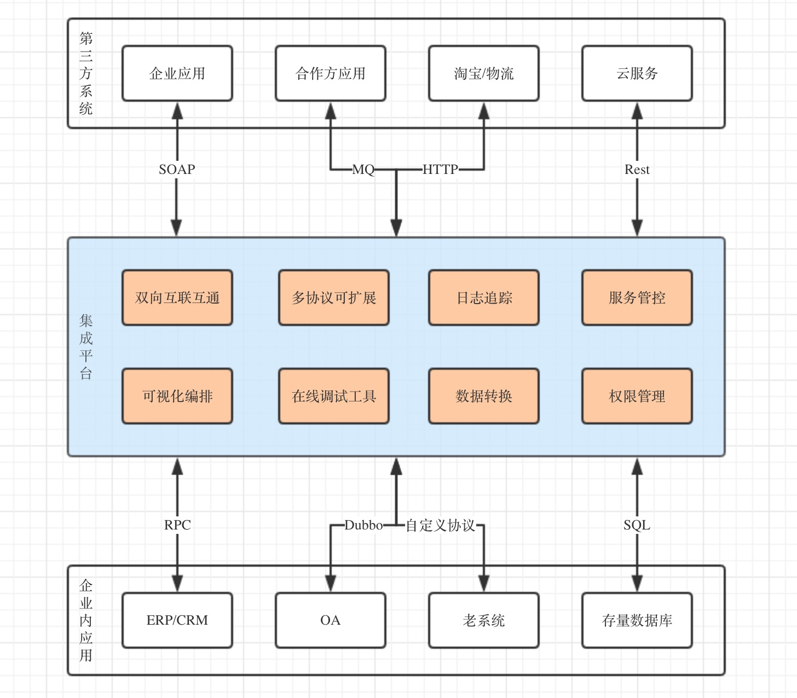

# 集成平台(Dalaran)

> Dalaran(达拉然)是魔兽世界中的一个中立城市, 后来成为部落和联盟的抗魔联军纽带. 以此为名, 希望该项目能够连接一切, 集成一切, 即便是两个水火不容的集团.

## 背景

在公司产品实施过程中, 难免会存在与客户公司已存在的系统对接, 因为不同企业可能使用不同的软件提供商, 即使同一提供商可能也不尽相同.

目前主要实现方式是对接逻辑硬编码于项目之中, 这就导致项目一定程度被腐化, 而且存在部分相对的重复工作量.

集成平台希望以配置的形式满足系统间的集成, 将集成逻辑和产品项目剥离开, 已达到实施上的防腐层存在, 同时可以承担产品对外开放的职责.

## 产品特性

1. 产品层面屏蔽对接逻辑, 可以作为产品实施防腐层.
2. 提供内外部 API 全生命周期管理.
3. 可视化无代码对接, 降低实施继承门槛, 快速对接.
4. 可双向集成, 无代码模式调整产品对外开放集成接口, 生成集成接口文档.
5. 提供通用场景的支撑, 如失败重试, 集成接口聚合等, 集成统计/监控/告警等, 无需额外编码.
6. 通过不断完善 Component 的过程, 沉淀复用集成场景, 避免重复工作.

## 关键词

* 无代码
* 可视化配置
* 可扩展
* 可观察

## 示意图

## 用户手册

* [概述](./docs/user/overview.md)
* [快速开始](./docs/user/quick-start.md)
* [触发器](./docs/user/trigger/index.md)
* [处理器](./docs/user/processor/index.md)
* [模型](./docs/user/model.md)
* [流程设计器](./docs/user/flow-design.md)

## 开发者手册

* [架构介绍](./docs/developer/architecture.md)
* [模块说明](./docs/developer/module.md)
* [集成流程](./docs/developer/flow.md)
* [流程设计器配置](./docs/developer/flow-design.md)
* [接口设计](./docs/developer/api-design.md)
* [触发器开发](./docs/developer/writing-trigger.md)
* [处理器开发](./docs/developer/writing-processor.md)
* [模型](./docs/developer/model.md)
* [发布](./docs/developer/publish.md)
* [监控](./docs/developer/monitor.md)
* [开发计划](./docs/developer/develop-plan.md)
* [其他](./docs/developer/other.md)

## 管理员手册

* [运行监控]