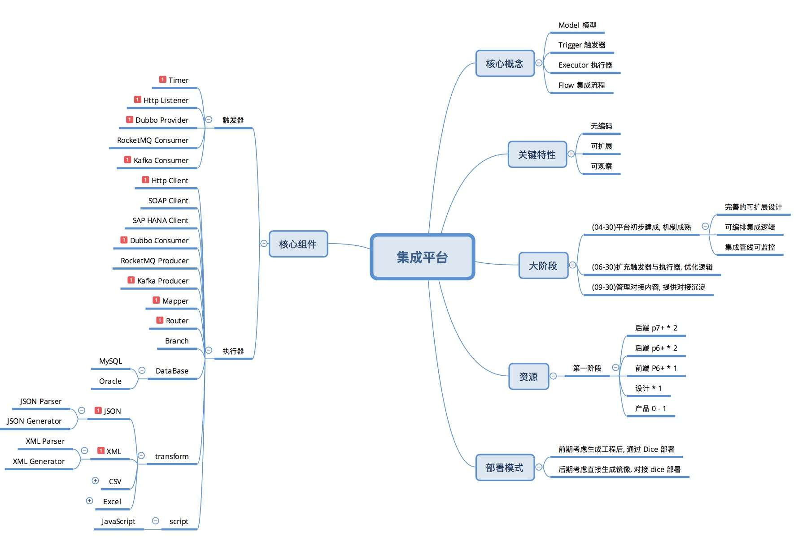

## 架构设计

集成平台整体设计是基于 [Apache Camel](http://camel.apache.org) 的, Camel 的详细说明本文不再赘述.

> Apache Camel is a powerful open source integration framework based on known Enterprise Integration Patterns with powerful bean integration.

Camel 提供了一系列集成向的 Component, 另外还有一套成熟的路由调度, 基于 Camel 做集成平台会减少很多底层工作量.

下述 `触发器/处理器` 等逻辑组件, 也是基于 Camel 的 component 标准进行扩展和配置封装, `集成流程` 本质上也是 Camel DSL 的封装.

> Apache Camel 基于 Apache License 2.0 授权协议, 商业友好.

### 可扩展设计

> 开发集成平台的触发器与处理器, 需要对 `Camel` 有一定了解, 可以查看[Camel Java DSL](http://camel.apache.org/java-dsl.html) 和 [Camel Component](http://camel.apache.org/components.html)

本产品最核心的可扩展点在于 `触发器` 和 `处理器`, 因为我们设计上都是基于 Camel 进行封装开发, 所以本质上 `触发器/处理器` 都是 Camel 中的 DSL 配置过程.

具体开发细节可以参考 [如何编写处理器](./writing-processor.md) 和 [如何编写触发器](./writing-trigger.md).


如果现有的 Camel component 不能满足需求, 可以自行定制 camel component, 在新的 trigger/processor 内加入其依赖即可, 如我们自行编写的 `Dubbo Component` 和 `RocketMQ Component`:

> camel component 的编写标准详见[Writing Camel components](http://camel.apache.org/writing-components.html)

### XMind



### 核心类图 (待更新)


### 核心逻辑

```sequence
DalaranStarter -> DalaranComponentLoader: 加载所有触发器和处理器
DalaranStarter -> FlowInitializer: 初始化容器
Note right of ResourceLoader: ResourceLoader 有 Console \n 和 Released 两个实现
FlowInitializer -> ResourceLoader: 加载所有集成流/连接器/模型等
FlowInitializer -> ResourceBuilder: 将加载的资源 Entity 转为通用配置模型
FlowInitializer -> DalaranContext: 构建加载集成流
DalaranContext -> DalaranFlowBuilder: 构建为 Camel DSL 的 Route 实例
DalaranContext -> DalaranStarter: 加载 Camel Route 并生效
```


