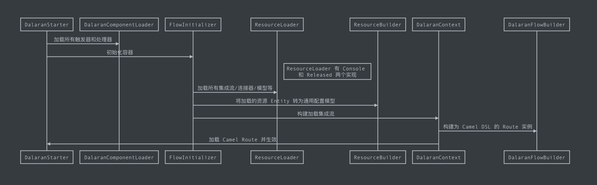
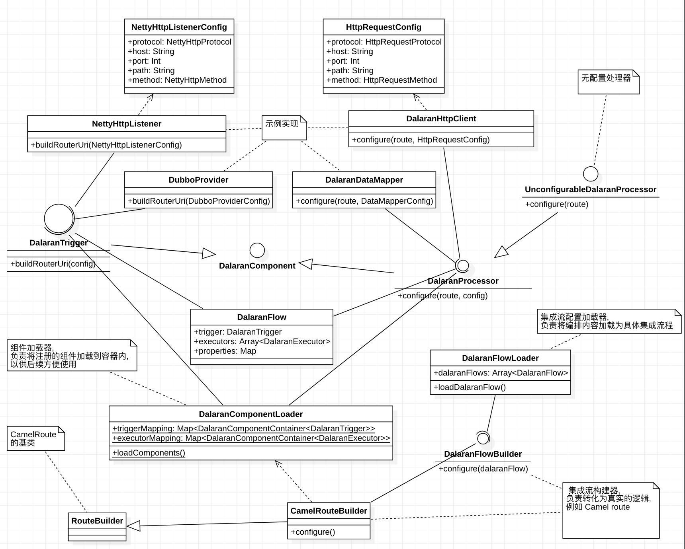

## 架构设计

集成平台整体设计是基于 [Apache Camel](http://camel.apache.org) 的, Camel 的介绍本文不在赘述.
其作为集成平台底层的路由调度框架, 上述 `触发器/执行器` 等逻辑组件, 也是基于 Camel 的 component 标准进行扩展和配置封装.
上述的 `集成流程` 本质上也是 Camel DSL 的封装.

> Apache Camel 基于 Apache License 2.0 授权协议, 商业友好.

### 核心概念

这里要描述的详细一些

* Trigger (触发器): 提供触发集成的服务, 一切集成流程的起点, 如监听 Http 请求, 定时触发, 消费消息等, 详见 触发器章节.
* Processor (执行器): 具体执行集成的逻辑动作, 如参数转换, Rest 调用, 读取数据等等, 详见 执行器章节.
* Flow (集成流程): 指从集成事件触发, 到所有集成动作完成的整体过程编排, 一般描述了整体的集成逻辑.
* Model (模型): 所有节点之间的传递的数据, 都是依赖模型描述, 数据映射转换也是基于模型处理.

### 可扩展设计

本产品最核心的可扩展点在于 `触发器` 和 `执行器`, 因为我们设计上都是基于 Camel 进行封装开发, 所以本质上 `触发器/执行器` 都是 Camel 中的 DSL 配置过程.

> 具体开发细节可以参考 [如何编写执行器](./writing-processor.md) 和 [如何编写触发器](./writing-trigger.md).

如果现有的 Camel component 不能满足需求, 可以自行定制 camel component, 在新的 trigger/processor 内加入其依赖即可, 如我们自行编写的 `Dubbo Component`:

> camel component 的编写标准详见[Writing Camel components](http://camel.apache.org/writing-components.html)

### 核心逻辑

```sequence
Dalaran -> DalaranComponentLoader: 加载所有触发器和执行器
Dalaran -> DalaranFlowLoader: 加载所有集成流程
DalaranFlowLoader -> CamelRouteBuilder: 转化为 Camel Java ds
CamelRouteBuilder -> DalaranComponentLoader: 过程中拉取所需触发器和执行器
CamelRouteBuilder -> DalaranFlowLoader: 注册并生效

```



### 核心类图



