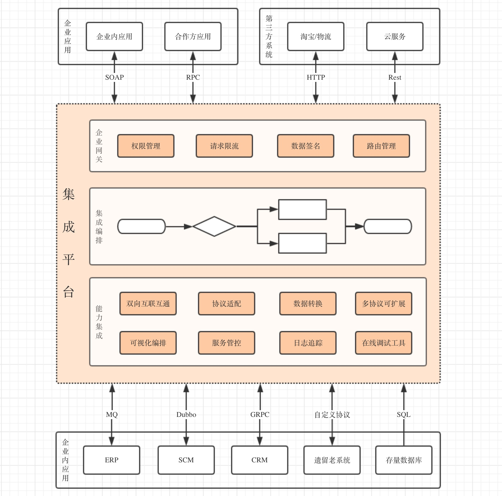

# 集成平台基本概念

## 基本概念
* 模块 (Module): 资源管理目录, 用于分类管理相关资源.
* Flow (集成流程): 即集成动作的编排流程, 指从集成事件触发, 到所有集成动作完成的整体过程编排, 一般描述了整体的集成逻辑.
* Trigger (触发器): 提供触发集成的服务, 一切集成流程的起点, 如监听 Http 请求, 定时触发, 消费消息等, 详见 触发器章节.
* Processor (处理器): 具体执行集成的逻辑动作, 如参数转换, Rest 调用, 读取数据等等, 详见 处理器章节.
* Model (模型): 描述了消息的结构化模型, 数据映射转换也是基于模型处理. 如果有 MDD 开发框架或平台, 可以考虑直接拉取过来, 详见模型章节.

## 高级概念
* Connector (连接器): 抽象节点的配置内容, 维护可复用的节点配置, 减少整体配置量.
* Service (服务): 根据接口说明文档导入的一组接口信息, 自动导入相关配置以及模型, 减少了大量的配置.
* 子流程 (SubFlow): 可复用的逻辑流程, 跟`集成流`一样, 具有出入参和执行逻辑, 但是没有触发器配置. 其触发方式为 `集成流` 增加 `子流程` 节点触发.
* 映射函数 (MappingFunction): 允许映射中自定义函数, 用来处理复杂的模型转换映射的支持, 详见 `数据映射` 章节
* 应用管理 (Application): 为对外开放 OpenAPI 提供了接入方管理, 即接入方的 AppKey 和 AppSecret 等信息的管理, 可配合具体触发器, 对接入请求进行校验和签名验证.

## 业务架构图

## 概念说明

#### 核心概念

> 这里, 有一个前提概念, 我们可以认为所有的集成动作, 都是一个可以编排的流程, 即有明确的开始方式, 明确的执行路径和结果声明.

以端点做软件实施的场景来说, 处理的系统间集成主要是接口之间的处理, 举个常见的例子:

我们内部有一个 Dubbo 接口, 比如获取库存, 这部分功能来自于企业现存 ERP, 使用 Rest 协议.

我们以代码的方式来处理, 会分为以下几步:

1. 创建一个 Dubbo 接口方法, 对内暴露, 确定入参(A in)/出参(A out).
2. 确定三方接口的协议, 以及入参(B in)/出参(B out).
3. 在 Dubbo 方法内, 将 Dubbo 入参(A in) 转为 Rest 入参(B in).
4. 调用 Rest client, 并且返回 Rest 出参(B out).
5. 将 Rest 出参(B out) 转为 Dubbo 出参(A out).

我们把这个过程以流程化的方式来表达, 就会得到下图:

当然, 如果有一些更复杂的处理, 代码中增加逻辑, 在流程化的图中, 也可以明确的加入具体逻辑节点来标识.

以上图所示, 我们的集成逻辑代码变成了一个流程图, 而这个流程图, 在集成平台中的概念就是 `集成流(Flow)`. 每一个集成的逻辑, 都是一个独立的集成流.

蓝色部分是我们暴露 Dubbo 方法的节点, 这种提供一个集成入口的形式, 我们称之为 `触发器(Trigger)`, 可以把触发器理解为方法签名, 他声明了会以何种形式触发具体的流程, 出参入参等. 

而白色的节点, 则是我们的处理部分, 即我们方法块内的代码逻辑, 这里只是对常见的场景操作进行了抽象, 通过配置即可完成相应的操作.

橙色的 End 节点, 只是逻辑表达流程的结尾, 可以理解为我们代码块中的 Return.

而节点之间的红色字体, 就是指代码中不断转换变化的出入参, 在集成平台中, 我们称之为 `模型(Model)`.

每个节点, 基本都会存在一些配置, 比如上述的 Dubbo 要配置注册中心地址, Service Id 等, Rest client 也要配置 Host, operation 的. 这些我们称之为节点配置, 即 `Config`.

以上, 就是集成平台最核心的概念.

#### 模块 (Module)

对上述相关资源进行归类管理, 可以理解为 Java 的 package 或者是文件夹.

#### 连接器 (Connector)

有一些配置, 可能会重复使用到, 以上述集成需求为例, Http 的请求我们会涉及到 协议, Host, 端口, 超时时间, 鉴权方式, Path 和 method. 

如果是同一个接口提供方, 理念上只有 Path 和 Method 会跟着接口不同而变化.
 
如果每次都要重复填写会比较麻烦, 改动时量比较大而且容易遗漏. 所以就提供了 `连接器(Connector)` 的概念, 我们可以创建对应的连接器, 用来复用一些重复性的配置.

#### 服务 (Service)

有一些带集成的服务, 会提供相关的标准说明文档, 类似于 Swagger 或者 WSDL 文件, 接口说明中已经明确了相关的接口信息与模型信息, 所以不需要再人工维护.

对于这种集成平台提供了 `服务 (Service)` 的概念, 只需要上传 Swagger 或者 WSDL 这种接口说明文档, 就可以快速选择其相关接口, 不需要再维护相关配置.

#### 子流程 (SubFLow)

在一些比较复杂的集成场景, 我们可能会有重复的逻辑, 需要在每个集成流中配置, 如此一来重复工作量就难以避免. 

子流程就是为了抽象重复逻辑, 可以认为是我们写代码的一个独立方法, 会在主方法或者循环中调用.

或者以此来实现一些复杂场景, 例如: 定时拉取数据, 无数据时等待下次执行, 有数据时再次执行, 直到没有数据. 

以上述例, 我们可以配置一个子流程, 子流程内配置 `获取数据 -> 路由节点判断是否有数据, 没有则直接返回, 有则继续 -> 执行保存数据 -> 子流程调用自身`. 如此一来, 我们就通过子流程配置了一个递归执行.

