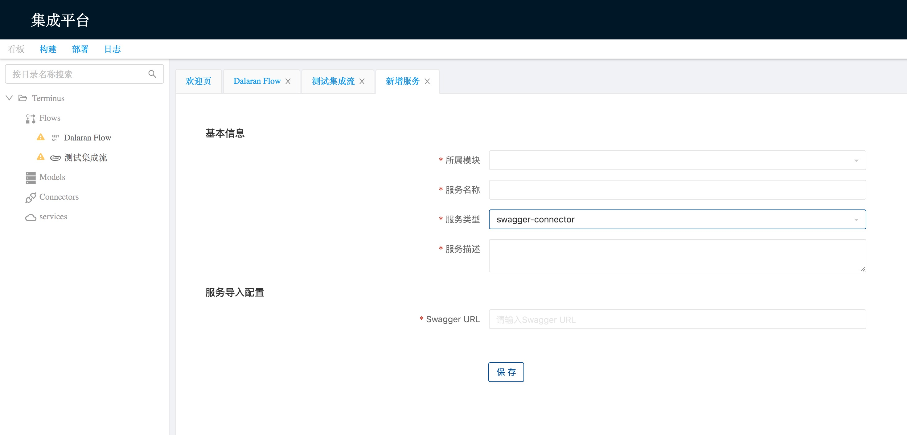
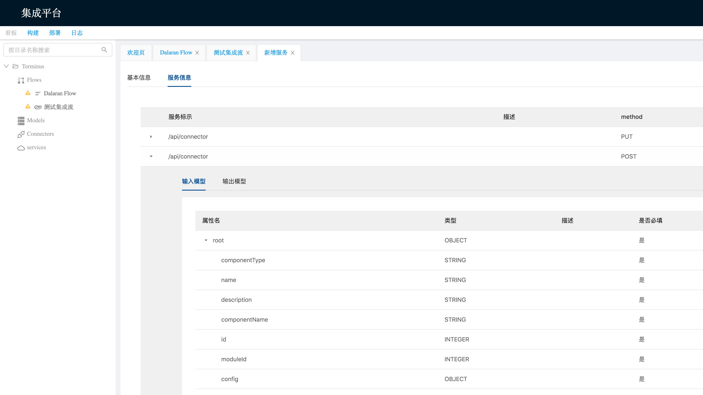
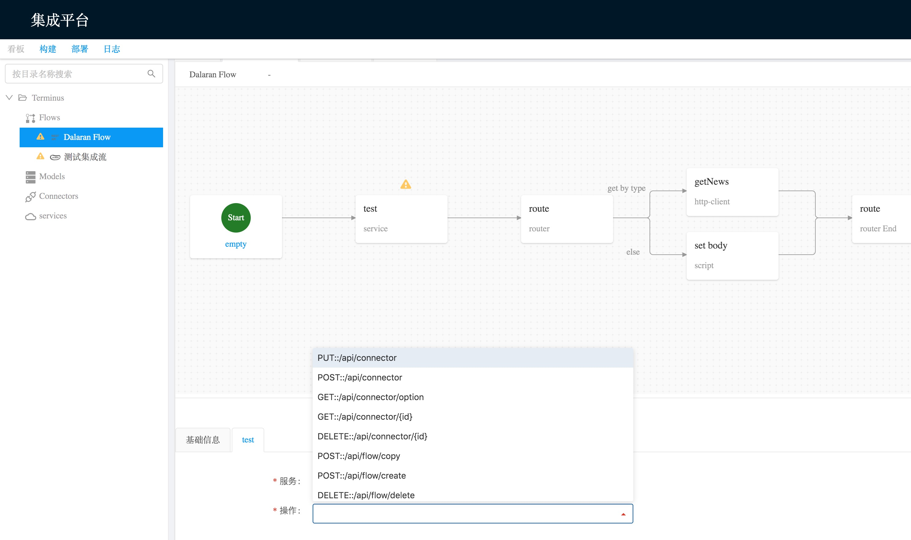

# 高级功能

### 服务 (Service)

服务一般是通过接口描述文件, 将一组接口的信息以及出入参信息导入. 这样就不需要在维护相关信息, 使用时只需要选择具体 API 即可.

Service 的创建比较简单, 在资源树上的 Service 栏点击新增, 并维护相关信息即可.

目前只支持 Swagger 和 WSDL 两种, 选择服务类型, 填入相关信息保存即可, 后端会自动拉取配置文件, 导入相关信息.

导入完成之后, 需要使用时, 在流程中加入 `Service` 处理器, 选择对应服务即可.

