# 开始

> 这里默认已经阅读过 [基本概念](../overview.md) 章节, 如果没有的话, 请先阅读.

这里, 我们还是以之前的基础例子作为演示内容:

1. 创建一个 Dubbo 接口方法, 对内暴露, 确定入参(A in)/出参(A out).
2. 确定三方接口的协议, 以及入参(B in)/出参(B out).
3. 在 Dubbo 方法内, 将 Dubbo 入参(A in) 转为 Rest 入参(B in).
4. 调用 Rest client, 并且返回 Rest 出参(B out).
5. 将 Rest 出参(B out) 转为 Dubbo 出参(A out).

如果我们把这个过程以流程化的方式来表达, 就会得到下图:

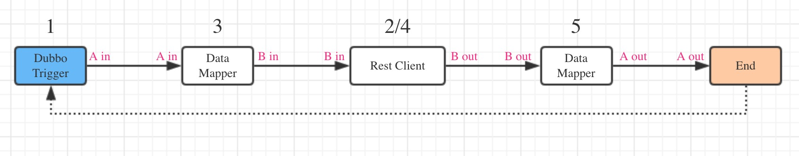

## 集成平台的配置

经过分析后, 我们把该集成内容分为几部分:

1. 并维护接口所使用到的模型, 包括触发器和处理器所使用的所有模型
2. 一个 集成流, 使用 Dubbo 的触发器, 对内开放 Dubbo 接口.
3. 入参转换 Mapper.
4. 一个 Rest client, 做第三方接口请求.
5. 出参转换 Mapper.

之后, 我们可以根据步骤进行操作.

### 1. 维护相关模型:

在资源树上, 新建一个模型.

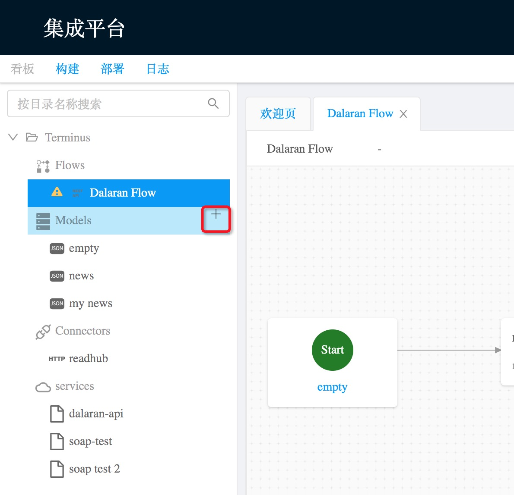

在弹框内填写模型的模型, 并选择模型类型, 具体根据接口的协议来选择. 我们的例子里是 Dubbo 和 Rest, 所以我们创建的模型分别是 Object 类型和 Json 类型.

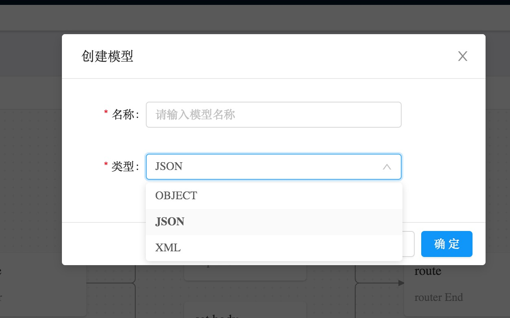

创建完成后, 可以点击具体模型, 点击结构导入, 完成相关模型结构的维护.

目前支持两种导入方式, 一种是 `Excel模板`, 就是下载一个模板, 然后将字段的名称, 类型, 说明等各种信息维护, 在将文件上传.

另外一种, 就是 `数据模板`, 提供一份相关数据样板内容, 提交后会根据数据反向解析出相关的数据结构.

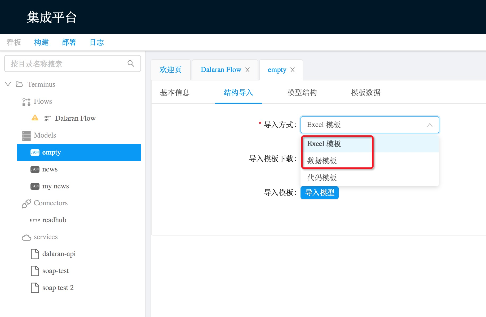

维护好相关模型后, 我们可以进入下一个步骤.

### 2. 创建流和触发器

现在我们需要完成集成的配置, 所以我们创建一个集成流.

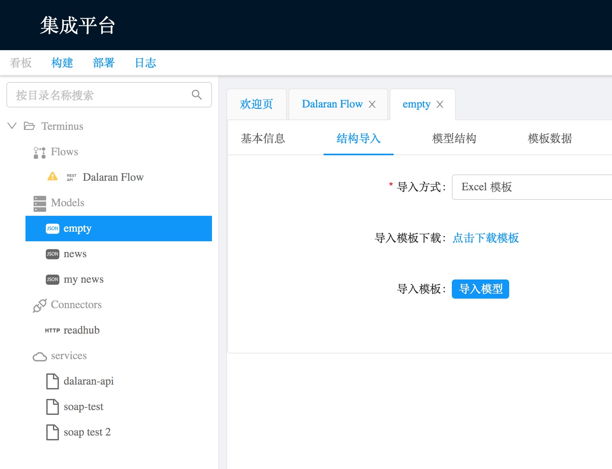

对内暴露的是一个 Dubbo 接口, 所以我们需要一个 Dubbo 的触发器, 这里选择 `dubbo-provider`. 

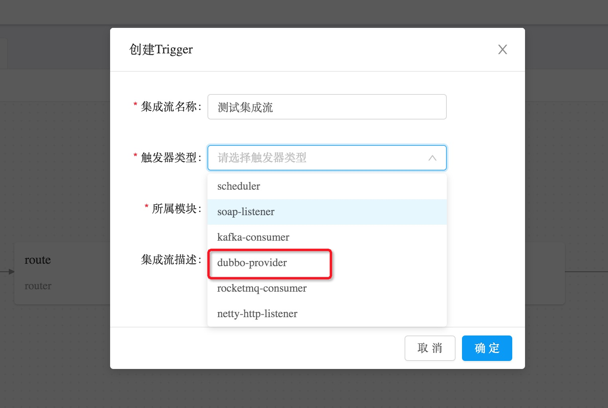

创建完成之后, 我们应该可以看到一个空的集成流, 只有开始和起始节点, 相关的配置也都为空.

此时可以点击 Start 或 End 节点, 下放会展开触发器相关的配置. 输入结构 和 输出结构 就对应了相关的出入参, 通过下拉框选择对应模型即可.

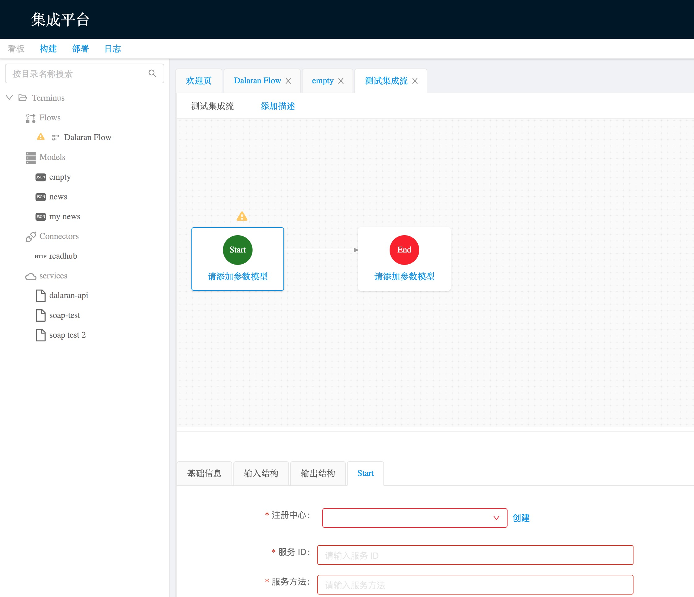

因为是 Dubbo, 会涉及到注册中心的配置, 注册中心是一个可复用的配置, 所以有对应的连接器, 我们选择创建后, 配置相关信息.

所有信息配置完毕后, 触发器和流的基本信息就配置完成了, 之后我们进行步骤 3.

### 3. 创建 Mapper 进行模型转换

触发器配置完毕后, 我们可以在流程内加入处理节点, 按照步骤来说, 我们需要加入一个 Mapper 节点, 做入参的转换映射. 在连接线上, 点击 `(+)` 新增节点, 选择 `Mapper-convert`, 命名后点击确认.

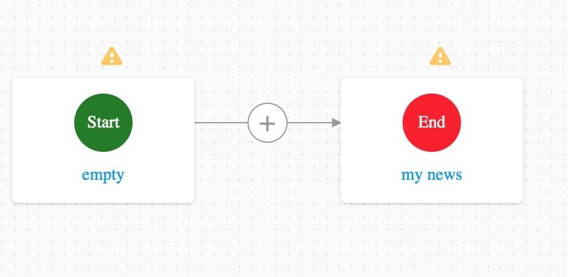
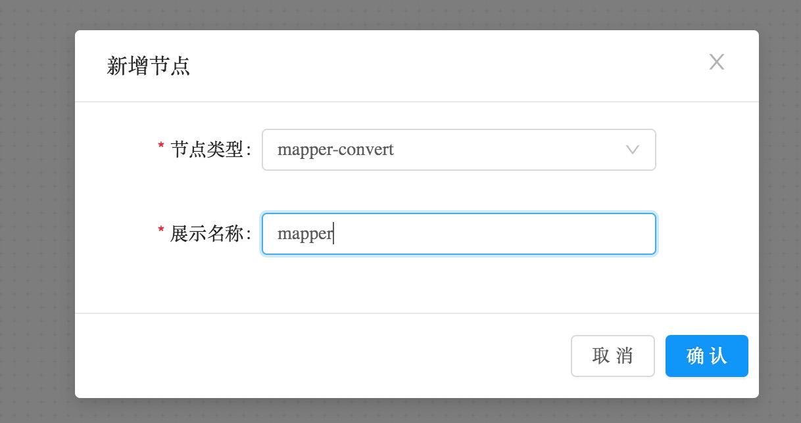

确认后, 图上会增加一个 mapper 节点, 点击后下放会出现 Mapper 的配置, 就是一个连线映射, 只需要将左边的字段连线到右边的目标字段即可. 

如果字段相似度较高, 可以点击自动映射, 会根据字段相似度, 全层级的自动关联, 下图就是直接点击自动映射的结果.

如果有数组之类的, 左右两边会要求有相同层级的数组, 因为需要循环完成创建赋值, 如果不同层级就会牵扯到 flat 或者 merge 等, 所以不支持.

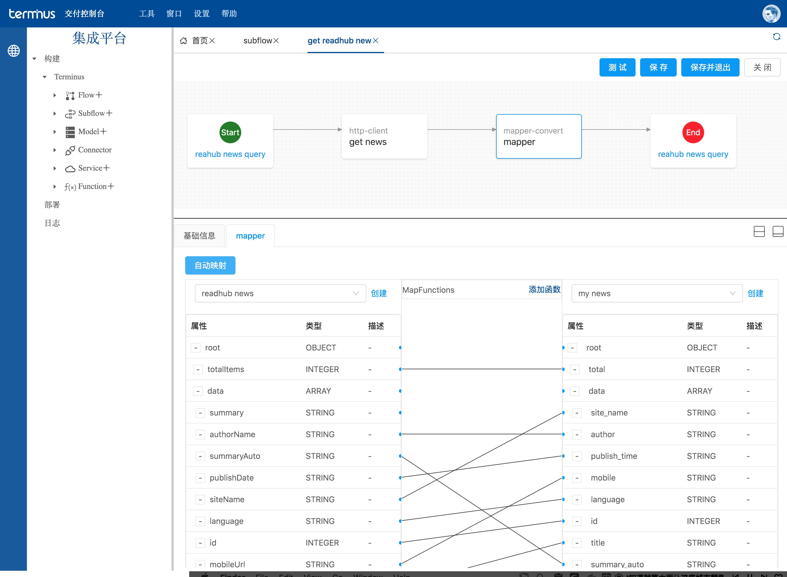

连线完成后, Mapper 节点就配置完成了. 当简单的赋值映射不能支撑我们的场景时, 我们可以使用映射函数来完成. 只需要增加函数, 将出入参连接即可. 

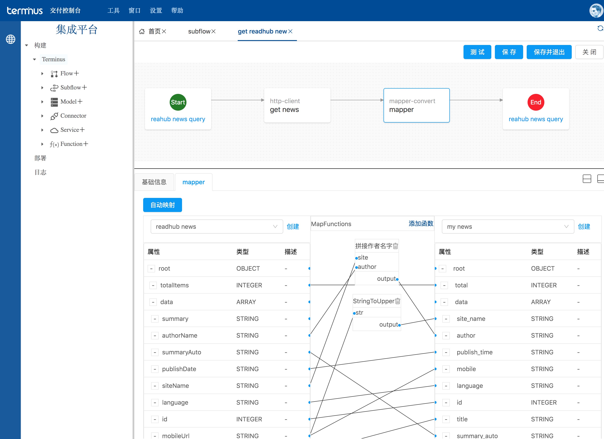

函数拥有两种, 一种是平台提供的标准函数, 比如字符串操作, 数字操作等;

另外一种是自定义函数, 允许用户自行维护, 只需要描述入参, 并且填入实现即可. 当前支持 `JavaScript` 和 `Groovy`.

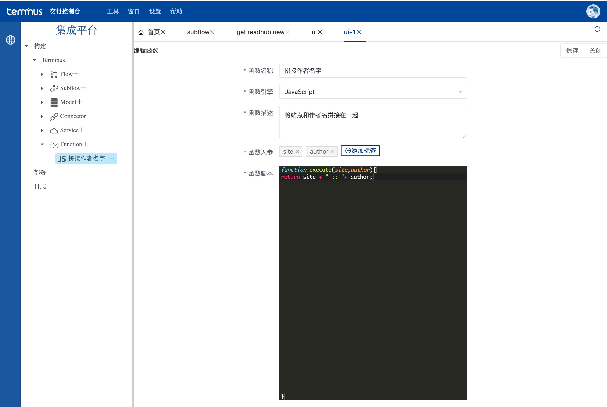

### 4. 创建 Client 节点访问三方接口

接下来, 我们需要去发起访问第三方接口, 我们的参数已经转换成了三方接口所需要的格式, 只需要在加入真实访问的节点即可. 例子为 Rest API, 所以我们创建一个 `Http Client` 进行访问, 并进行相关配置, 此部分不在赘述.

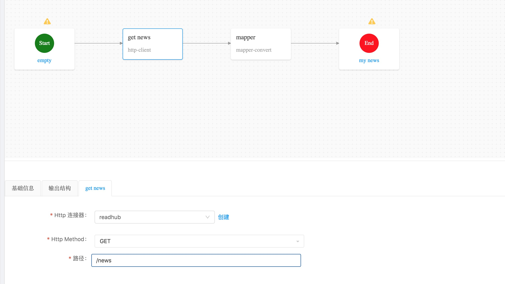

### 5. 创建 Mapper 进行模型转换

如步骤 3, 不再赘述.

当我们上述步骤全部配置完成后, 集成流已经配置完毕. 接下来, 我们可以测试该流程, 以验证是否符合我们的预期.

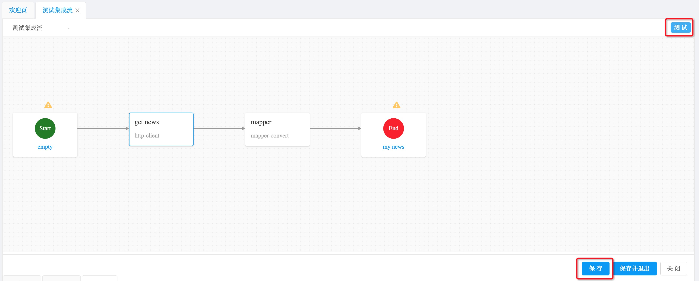

## 在线测试

流程保存后, 点击流程右上角的测试按钮, 会弹出测试框. 填入入参后, 点击测试就会发起.

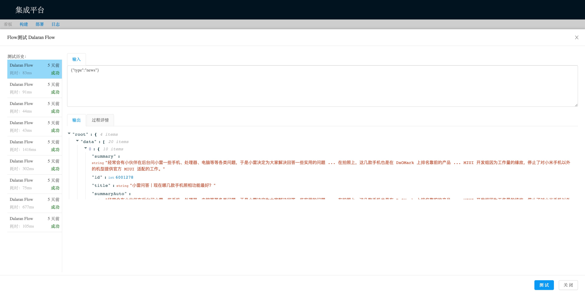

返回值和每个节点的输入输出, 耗时等都会返回, 可以依此来调整我们的集成流的过程, 快速发现问题所在.

## 发布

当流程测试完毕, 确认符合需求后, 我们可以进行发布动作, 将流程发布为真实运行的流程, 部署完毕后, 就会真正的暴露相关 API.

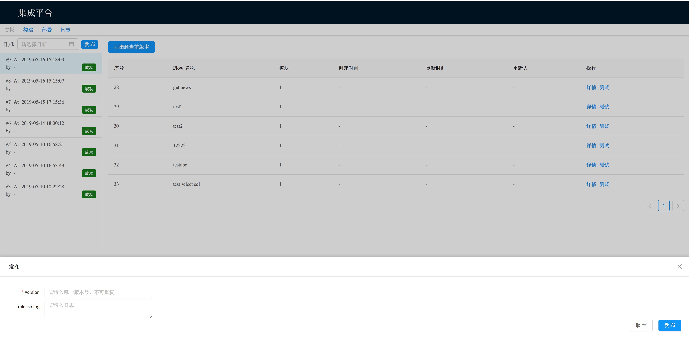

发布成功之后, 就可以尝试真实的访问暴露的接口, 验证是否符合预期.

## 日志

发布后流程会开始运行, 对外提供服务. 默认情况下, 每次访问都会记录相关日志, 成功与否, 耗时多少等, 错误情况下也会记录在那个节点发生的错误, 每个节点的输入输出是什么, 便于我们排查问题.

日志查看只需要点击日志菜单, 根据条件搜索具体的日志即可, 点击详情会展开日志的相关信息.

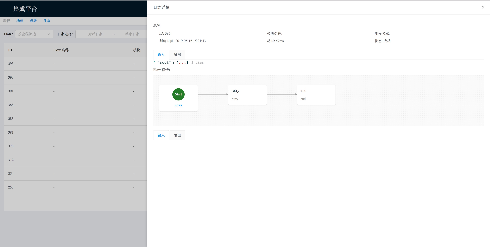
